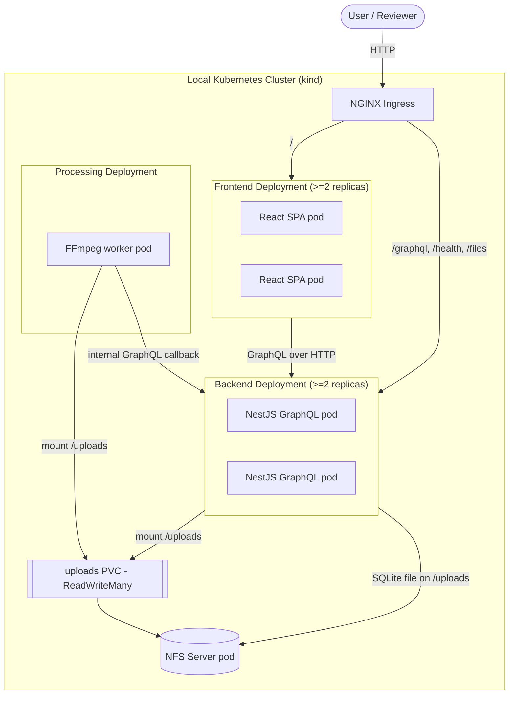
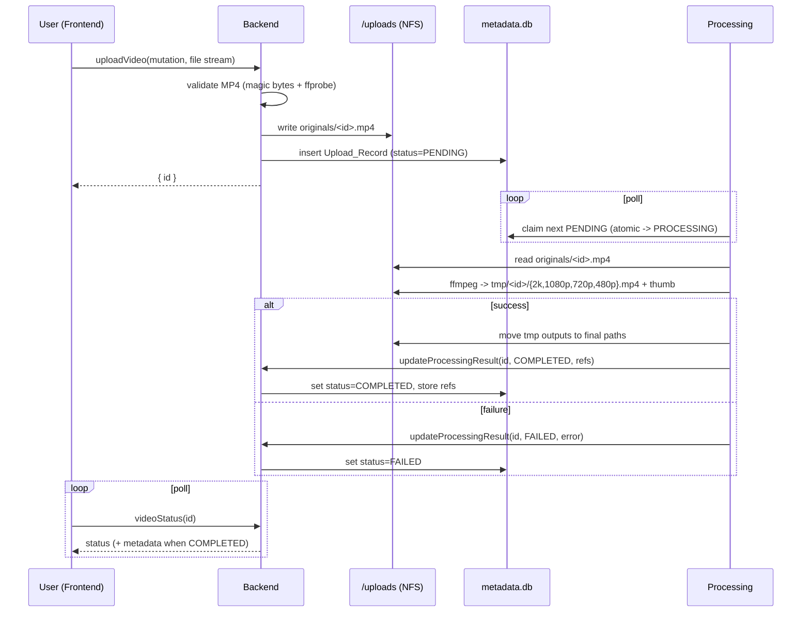
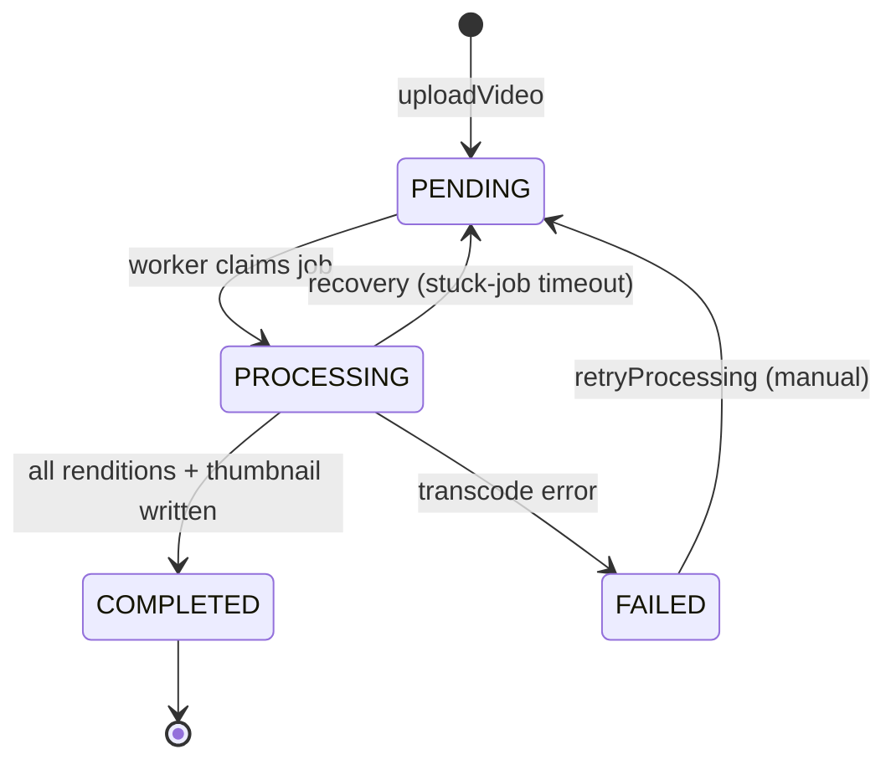
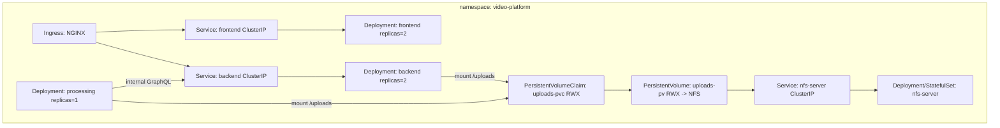

# Design Document

## Overview

This design describes a video upload and processing platform that runs entirely on a local
Kubernetes cluster. Users upload MP4 videos (up to 4K) through a ReactJS single-page application.
A NestJS GraphQL backend accepts the uploads, writes them to an NFS-backed shared filesystem, and
records metadata. A dedicated processing component watches for pending work, transcodes each video
into 2K / 1080p / 720p / 480p renditions plus a thumbnail using FFmpeg, and updates status. The
frontend polls status and, once processing completes, shows the thumbnail and links to each
rendition.

The design deliberately supports an incremental build order that mirrors the requirements grouping:

1. Storage foundation (NFS PV/PVC, `/uploads`) — Requirement 1
2. Backend API (upload, list, status, metadata, health) — Requirements 2–5
3. Processing component (FFmpeg renditions, thumbnail, recovery) — Requirements 6–7
4. Frontend (upload, listing, status, playback) — Requirements 8–9
5. Kubernetes deployment (manifests, access endpoint, cleanup) — Requirement 10
6. High availability and failover (replicas, probes, rolling updates) — Requirements 11–12
7. Documentation and deliverables — Requirements 13–15

### Key Design Decisions

| Decision | Choice | Rationale |
| --- | --- | --- |
| Metadata store | **SQLite on the shared NFS volume**, accessed by the backend only | Avoids running a separate database in a "local, no paid cloud" constraint while still giving transactional updates and queryable records. The processing component does **not** write the DB directly; it signals the backend, which owns all writes. This sidesteps NFS file-locking hazards with concurrent SQLite writers. See "Metadata Persistence" for the full justification and the JSON-sidecar fallback. |
| Backend ↔ processing coupling | **DB-backed job queue** (status column acts as the queue) plus optional in-cluster polling | Simple, durable, and recoverable. No extra broker (Redis/RabbitMQ) needed for a local demo, and the queue survives pod restarts because it lives on shared storage. |
| Who owns status writes | **Backend owns all metadata writes**; processing calls back via an internal GraphQL mutation | Single-writer model prevents NFS SQLite corruption and keeps the durability guarantees clear. |
| Shared storage | **NFS with `ReadWriteMany` PV/PVC**, provisioned by an in-cluster NFS server | `RWX` is required so backend and processing pods (and multiple backend replicas) mount `/uploads` concurrently. Most local `hostPath`/default storage classes are `RWO` only. |
| K8s packaging | **Kustomize** (base + overlays) | Native to `kubectl`, no extra tooling like Helm to install, and overlays cleanly express the "single replica dev" vs "HA" variants. |
| Local cluster | **kind** (Kubernetes in Docker) | Fast, scriptable, single-command bring-up; works on any machine with Docker; easy to document for reviewers. minikube is documented as an alternative. |
| Access endpoint | **NGINX Ingress** (installed into kind) with `port-forward` documented as a fallback | Gives a single host for frontend + backend and is reproducible; fallback keeps the demo working if ingress is unavailable. |

The table above is the quick reference. The full reasoning for each choice — the problem it
solves, why it was picked over the alternatives, its pros, its trade-offs, and how it would change
for production — is documented in
"[Technology & Solution Choices — Rationale, Trade-offs, and Limitations](#technology--solution-choices--rationale-trade-offs-and-limitations)"
below, with a single honest summary in
"[Consolidated Limitations](#consolidated-limitations)".

## Assumptions

These assumptions frame the whole design. They are stated explicitly so a reviewer can reproduce the
system and judge the engineering trade-offs fairly (evaluation criteria: *documentation is clear and
honest*, *trade-offs and limitations are understood*, *local deployment is reproducible*).

- **Local, single-node cluster.** The target is a single-node `kind` cluster on the reviewer's
  machine. Because there is one node, the in-cluster NFS server and every pod that mounts `/uploads`
  land on the same node. This keeps `ReadWriteMany` reliable without a real distributed filesystem,
  but means the demo does not exercise cross-node NFS traffic. This is called out because it changes
  the strength of the failover claim (pod-level failover is demonstrated; node-level is not).
- **Reviewer tooling.** The reviewer has Docker, `kubectl`, and `kind` installed (versions noted in
  the README). No paid cloud account, cluster, or managed service is required for the core solution;
  cloud deployment is an explicitly optional bonus.
- **Demo scale.** Demonstration uses one short MP4 `Sample_Video` and a small number of concurrent
  uploads. The design targets low concurrency; it is not tuned or load-tested for many simultaneous
  4K uploads.
- **Downscale-only renditions.** Renditions are only ever produced at or below the source resolution
  (a 480p source is never upscaled to 2K). Metadata therefore lists only the renditions that were
  actually produced for a given source.
- **Trusted single-tenant demo.** There is no authentication, authorization, user accounts, or
  multi-tenancy in scope. Anyone who can reach the `Access_Endpoint` can upload and list videos. This
  is acceptable for a local reviewer demo only and is flagged as a production gap.
- **MP4-only input.** Only MP4 container input is accepted and validated. Other container/codec
  combinations are out of scope.
- **Ephemeral node-backed storage.** NFS is backed by a directory on the kind node. It survives pod
  restarts (the durability requirement) but not deletion of the kind cluster itself; cleanup is
  expected to remove it.
- **No CDN / external file delivery.** Rendition and thumbnail bytes are served by the backend file
  route, not a CDN or object-store URL. Fine for a demo, not how large media would be delivered in
  production.

## Architecture

### System Context



### Component Responsibilities

- **Frontend (React SPA):** File selection and upload UI, listing view, per-video status polling,
  thumbnail display, rendition links/playback. Talks to the backend exclusively over GraphQL
  (Apollo Client). Served as static assets by an NGINX container; runs stateless with multiple
  replicas.
- **Backend (NestJS + Apollo Server):** GraphQL API for `uploadVideo`, `videos`, `videoStatus`,
  `videoMetadata`, plus an internal `updateProcessingResult` mutation used by the processing
  component. Streams file bytes to `/uploads` via `graphql-upload`. Owns the SQLite metadata store.
  Serves rendition/thumbnail files over an HTTP file route. Exposes `@nestjs/terminus` health checks
  (including an `/uploads` reachability check). Stateless (all durable state on shared storage),
  runs with multiple replicas.
- **Processing component:** A Node worker that claims `PENDING` records, transcodes with FFmpeg into
  four renditions and a thumbnail, writes outputs to `/uploads`, and reports success/failure back to
  the backend. Handles recovery of interrupted jobs and retry of `FAILED` jobs.
- **Shared storage (NFS):** A single `ReadWriteMany` volume mounted at `/uploads` by backend and
  processing pods. Holds original uploads, generated outputs, and the SQLite metadata file.

### Directory Layout on `/uploads`

```
/uploads
  metadata.db                     # SQLite database (backend-owned)
  originals/<uploadId>.mp4        # original uploaded file
  renditions/<uploadId>/2k.mp4
  renditions/<uploadId>/1080p.mp4
  renditions/<uploadId>/720p.mp4
  renditions/<uploadId>/480p.mp4
  thumbnails/<uploadId>.jpg
  tmp/<uploadId>/                 # in-progress FFmpeg output, atomically moved on success
```

Outputs are written to `tmp/<uploadId>/` and moved into their final location only after FFmpeg
succeeds, so partial files are never visible as completed renditions (supports recovery/retry).

### Request and Processing Flow



## Components and Interfaces

### Frontend (ReactJS)

- **Stack:** React + TypeScript, Apollo Client for GraphQL (`apollo-upload-client` for multipart
  file uploads), built with Vite, served by NGINX.
- **Views:**
  - Upload view: `<input type="file" accept="video/mp4">`, submit button, progress/success/error
    banner.
  - List view: table/grid of uploads showing filename, upload time, and live status badge.
  - Detail/playback: thumbnail image once `COMPLETED`, and links or an HTML5 `<video>` player with
    selectable rendition sources.
- **Behavior:** Polls `videos` / `videoStatus` on an interval to reflect status transitions. All
  network access goes through the Apollo GraphQL client; file downloads/playback use backend file
  URLs returned in metadata.

### Backend (NestJS GraphQL)

GraphQL schema sketch:

```graphql
scalar Upload
scalar DateTime

enum ProcessingStatus { PENDING PROCESSING COMPLETED FAILED }

type Rendition {
  label: String!        # "2K" | "1080p" | "720p" | "480p"
  url: String!          # backend file route
  width: Int
  height: Int
}

type VideoMetadata {
  id: ID!
  status: ProcessingStatus!
  renditions: [Rendition!]!   # empty unless COMPLETED
  thumbnailUrl: String        # null unless COMPLETED
}

type UploadRecord {
  id: ID!
  originalFilename: String!
  uploadedAt: DateTime!
  status: ProcessingStatus!
}

type Query {
  videos: [UploadRecord!]!
  videoStatus(id: ID!): ProcessingStatus!
  videoMetadata(id: ID!): VideoMetadata!
}

type Mutation {
  uploadVideo(file: Upload!): UploadRecord!
  # internal, used by the processing component
  updateProcessingResult(input: ProcessingResultInput!): UploadRecord!
  # documented manual retry mechanism (Req 7.2)
  retryProcessing(id: ID!): UploadRecord!
}

input RenditionInput { label: String!, path: String!, width: Int, height: Int }
input ProcessingResultInput {
  id: ID!
  status: ProcessingStatus!     # PROCESSING | COMPLETED | FAILED
  renditions: [RenditionInput!]
  thumbnailPath: String
  error: String
}
```

- **Upload handling:** `graphql-upload` streams the incoming file directly to
  `originals/<id>.mp4` to avoid buffering large (4K) files in memory. Validation combines MP4 magic
  bytes (`ftyp` box) with an `ffprobe`/container check; invalid files are rejected before a record
  is created (Req 2.4).
- **File serving:** A REST-style route (`/files/...`) streams renditions and thumbnails from
  `/uploads` with appropriate content types and range support for video playback. GraphQL metadata
  returns these URLs (Req 4.3, 4.4). The frontend still performs all *API* calls via GraphQL
  (Req 9.5); binary file fetches use these URLs.
- **Health:** `@nestjs/terminus` exposes `/health/live` and `/health/ready`. Readiness includes a
  writable-check on `/uploads`; if unreachable, the backend reports unhealthy (Req 5.2). Probes are
  designed to respond well within 5 seconds (Req 5.3).
- **Metadata ownership:** Only the backend writes `metadata.db`. The processing component reports
  results through `updateProcessingResult`, keeping a single writer to the SQLite file.

### Processing Component

- **Stack:** Node + TypeScript worker, `fluent-ffmpeg` (or direct `ffmpeg` CLI), FFmpeg in the
  container image.
- **Job acquisition:** Polls the backend (internal GraphQL) or the DB via a backend-provided
  `claimNext` operation that atomically transitions one `PENDING` record to `PROCESSING`
  (Req 6.1). Atomic claim prevents two workers grabbing the same job.
- **Transcode:** For each target resolution, runs FFmpeg scaling with aspect-ratio preservation and
  downscale-only behavior (a 480p source is not upscaled to 2K; missing higher renditions are
  handled gracefully). Generates one thumbnail via a single-frame extract (Req 6.2, 6.3).
- **Completion:** After all outputs are atomically moved into place, calls
  `updateProcessingResult(COMPLETED, refs)` (Req 6.4). On any failure, calls
  `updateProcessingResult(FAILED, error)` (Req 6.5).
- **Recovery:** On startup, the backend can re-queue records stuck in `PROCESSING` past a timeout
  (a pod that died mid-job) back to `PENDING`, making them eligible again (Req 7.1). Because outputs
  are written to `tmp/` and moved atomically, a retried run cleans `tmp/<id>/` and reproduces a full
  output set equivalent to a first success (Req 7.3).
- **Retry:** `retryProcessing(id)` resets a `FAILED` record to `PENDING` (documented mechanism,
  Req 7.2).

### Shared Storage Interface

- PVC `uploads-pvc` (`ReadWriteMany`) mounted at `/uploads` in backend and processing pods.
- Provisioned by an in-cluster NFS server exporting a backing directory, exposed via a
  `ReadWriteMany` PV. See "Kubernetes Topology".

## Data Models

### Upload_Record (SQLite table `upload_records`)

| Column | Type | Notes |
| --- | --- | --- |
| `id` | TEXT (UUID) PK | Unique identifier returned to clients (Req 2.3) |
| `original_filename` | TEXT | As provided by the client (Req 3.2) |
| `stored_path` | TEXT | `originals/<id>.mp4` |
| `uploaded_at` | TEXT (ISO-8601) | Upload timestamp (Req 3.2) |
| `status` | TEXT | `PENDING` \| `PROCESSING` \| `COMPLETED` \| `FAILED` |
| `processing_started_at` | TEXT NULL | Used for stuck-job recovery timeout |
| `thumbnail_path` | TEXT NULL | `thumbnails/<id>.jpg` when `COMPLETED` |
| `error` | TEXT NULL | Populated when `FAILED` |

### Rendition (SQLite table `renditions`)

| Column | Type | Notes |
| --- | --- | --- |
| `id` | INTEGER PK | Autoincrement |
| `upload_id` | TEXT FK -> upload_records.id | |
| `label` | TEXT | `2K` \| `1080p` \| `720p` \| `480p` |
| `path` | TEXT | `renditions/<uploadId>/<label>.mp4` |
| `width` | INTEGER NULL | |
| `height` | INTEGER NULL | |

### Processing_Status lifecycle



### Metadata Persistence — choice and justification

**Chosen: SQLite file on the shared NFS volume, written only by the backend.**

Two candidate approaches were considered given the "local K8s, shared filesystem, no paid cloud"
constraints:

1. **Shared-filesystem JSON metadata** (one JSON file per upload, or a single index file). Simple
   and requires no DB engine, but concurrent writers over NFS risk lost updates and torn files, and
   listing/querying means scanning many files. Multiple backend replicas writing JSON concurrently
   is unsafe without an external lock.
2. **Relational DB (SQLite or Postgres).** Postgres gives the cleanest concurrency story but adds a
   stateful service (and a `ReadWriteOnce` volume) to operate, run migrations for, and back up —
   heavier than this local demo warrants. SQLite needs no separate service.

**Decision:** Use **SQLite** stored at `/uploads/metadata.db`, with a **single-writer model**: only
the backend writes it. The processing component never opens the DB; it reports results through the
backend's `updateProcessingResult` mutation. This gives transactional status updates and easy
querying while avoiding the well-known hazard of multiple SQLite writers over NFS. To keep multiple
backend replicas safe, writes are funneled through a serialized write path (a single write
connection with a short-held mutex / `BEGIN IMMEDIATE`), and WAL is avoided on NFS in favor of
default rollback journal with retry-on-busy.

**Trade-off / limitation (documented for the architecture doc):** SQLite over NFS is acceptable for
a low-concurrency local demo but is not the production choice; the production notes will recommend
migrating to Postgres (or a managed DB) and moving large-file metadata/queueing to a real broker for
high concurrency. A JSON-sidecar fallback remains viable if SQLite-over-NFS proves flaky in the
target environment, at the cost of query convenience.

## Technology & Solution Choices — Rationale, Trade-offs, and Limitations

This section is the heart of the "engineering judgment" story. For each major decision it records
the **problem** being solved, **why** this option beat the alternatives, its **pros**, its
**cons/trade-offs**, its **limitations** (especially local vs production), and **what would change
for production**. The goal is honest reasoning, not tool count — the design deliberately keeps the
number of moving parts small and justifies every part that exists.

How this maps to the assessment's evaluation criteria:

- *System works end to end* — the stack below (React → NestJS/GraphQL → NFS → FFmpeg worker) is the
  smallest set of components that delivers upload → store → transcode → view.
- *Local deployment reproducible* — `kind` + Kustomize, no paid services, single-command bring-up.
- *Upload and processing work correctly* — GraphQL upload streaming + FFmpeg renditions/thumbnail.
- *Storage shared and survives failover* — NFS `ReadWriteMany` outliving pods.
- *Kubernetes designed with production awareness* — replicas, probes, rolling updates, plus explicit
  "what changes in production" notes per decision.
- *Failover demonstrated clearly* — multi-replica stateless tiers + durable shared storage.
- *Documentation clear and honest* — pros AND cons for every choice; nothing oversold.
- *AI used responsibly* — see `docs/ai-usage-log.md` (out of scope for this document).
- *Trade-offs and limitations understood* — this section plus "Consolidated Limitations".
- *Maintainable by an engineering team* — mainstream, well-documented tools; single-writer data
  model; clear seams between transport, processing, and UI.

### Decision 1: Local Kubernetes cluster — `kind`

- **Problem it solves:** Requirement 10 needs a local, reproducible Kubernetes environment a
  reviewer can stand up on their own machine with no paid cloud.
- **Why chosen over alternatives:**
  - *minikube* — heavier, often pulls a VM/driver, slower cold start, and image loading is less
    ergonomic than `kind load`. Documented as a supported fallback.
  - *k3d (k3s in Docker)* — excellent and light, but k3s swaps in its own components (Traefik,
    local-path, servicelb) that differ from "vanilla" Kubernetes, making manifests slightly less
    portable to a standard cluster.
  - *Docker Desktop Kubernetes* — convenient where already installed, but licensing on some orgs and
    a GUI dependency hurt scripted reproducibility.
  - *kind* — runs vanilla Kubernetes in Docker, is fully scriptable (one command bring-up), matches
    upstream behavior, and `kind load docker-image` gives fast local image use without a registry.
- **Pros:** Fast, scriptable, CI-friendly, closest to upstream Kubernetes, trivial local images.
- **Cons / trade-offs:** Single-node by default, so it does not model multi-node scheduling or
  cross-node networking realistically. Cluster is ephemeral (deleting it deletes data).
- **Limitations (local vs prod):** Node-level failover and true multi-node RWX are not demonstrated;
  only pod-level failover on one node is.
- **What changes for production:** Replace with a managed/real multi-node cluster (EKS/GKE/AKS or
  on-prem); manifests stay largely the same because we target vanilla Kubernetes.

### Decision 2: Packaging — Kustomize

- **Problem it solves:** Requirement 10.1 allows manifests/Helm/Kustomize; we need to express a
  "single-replica dev" variant and an "HA" variant without duplicating YAML.
- **Why chosen over alternatives:**
  - *Plain manifests* — simplest to read but forces copy-paste for the dev vs HA replica/probe
    differences, which drifts over time.
  - *Helm* — powerful templating and packaging, but adds a tool to install, a templating language to
    learn, and more machinery than a small local demo justifies.
  - *Kustomize* — built into `kubectl` (`-k`), no extra install, and overlays express environment
    differences as small patches over a shared base.
- **Pros:** No extra tooling, native to `kubectl`, clean base/overlay separation, easy to diff.
- **Cons / trade-offs:** Less powerful than Helm for parameterization and no packaging/release
  semantics or dependency management.
- **Limitations:** As the number of environments/values grows, patch overlays get harder to follow
  than templated values.
- **What changes for production:** Larger orgs commonly move to Helm (or Kustomize + Argo/Flux for
  GitOps); the base manifests here translate cleanly to a Helm chart if needed.

### Decision 3: Shared storage — NFS with `ReadWriteMany` (central to the failover criterion)

- **Problem it solves:** Requirement 1 and 12 — backend and processing pods (and multiple backend
  replicas) must read/write the *same* `/uploads` concurrently, and files must survive pod
  restart/failover.
- **Why chosen over alternatives:**
  - *`hostPath`* — trivial locally but is `ReadWriteOnce` in practice, tied to one node/pod, and does
    not model shared storage or survive rescheduling cleanly. Fails the "shared across workloads"
    requirement.
  - *Cloud object storage (S3/GCS/MinIO)* — the real production answer for media, but the core
    solution must run locally with no paid cloud; adding MinIO would introduce an object-store API
    and rewrite the file-path model just for the demo (unnecessary complexity).
  - *Cloud file storage (EFS/Filestore)* — managed RWX, but paid cloud and not local.
  - *NFS with RWX PV/PVC* — the only option that is local, free, genuinely `ReadWriteMany`, and
    survives pod deletion, letting us demonstrate the storage-survives-failover criterion directly.
- **Pros:** True concurrent multi-pod mounts; durable across pod restarts; POSIX file semantics so
  the app just reads/writes paths; no paid services.
- **Cons / trade-offs:** NFS has weaker consistency and file-locking semantics than a local disk
  (this is exactly why the metadata store uses a single-writer model); a single in-cluster NFS
  server is itself a single point of failure.
- **Limitations (local vs prod):** In a single-node kind cluster the NFS server and clients share a
  node, so we do not prove cross-node NFS behavior; the NFS server pod is not itself HA.
- **What changes for production:** Use object storage (S3/GCS) for media with a CDN for delivery, or
  a managed RWX filesystem (EFS/Filestore) if POSIX semantics are required; make the storage tier HA
  and backed up.

### Decision 4: Metadata store — SQLite on NFS, single-writer

- **Problem it solves:** Requirements 2–4 need durable, queryable Upload_Records and status without
  a paid/heavy database in a local demo.
- **Why chosen over alternatives:** See "Metadata Persistence — choice and justification" above for
  the full comparison. Summary:
  - *JSON sidecar files* — no engine needed, but concurrent NFS writers risk lost/torn updates and
    listing means scanning many files.
  - *Postgres* — best concurrency story, but adds a stateful service, a `ReadWriteOnce` volume,
    migrations, and backups — heavier than the demo warrants.
  - *SQLite (chosen)* — transactional and queryable with zero extra services, made safe on NFS by a
    strict single-writer model (only the backend writes; processing reports via a mutation).
- **Pros:** No separate DB service; real transactions and SQL queries; the DB file lives on the same
  durable NFS volume, so metadata survives failover alongside the media.
- **Cons / trade-offs:** SQLite over NFS is fragile under concurrent writers, which forces the
  single-writer design and a serialized write path (mutex / `BEGIN IMMEDIATE`, no WAL on NFS,
  retry-on-busy). Write throughput is intentionally limited.
- **Limitations:** Not suitable for high write concurrency or many backend replicas hammering
  writes; effectively one writer at a time.
- **What changes for production:** Migrate to Postgres (or a managed DB) with a connection pool and
  migrations; the single-writer funnel disappears.

### Decision 5: Job queue — DB status column (no external broker)

- **Problem it solves:** Requirement 6/7 — hand pending work to the processing component durably and
  recover it after a crash.
- **Why chosen over alternatives:**
  - *Redis / RabbitMQ / BullMQ* — purpose-built queues with retries, delays, and visibility timeouts,
    but each adds another stateful service to deploy, secure, and reason about for a local demo.
  - *DB-backed queue (chosen)* — the `status` column *is* the queue; a worker atomically claims the
    next `PENDING` row (`UPDATE ... WHERE status='PENDING'`). It is durable (lives on NFS), survives
    pod restarts, and needs zero new infrastructure.
- **Pros:** No extra broker; the queue is durable and recoverable on shared storage; stuck-job
  recovery and manual retry are simple state transitions; one fewer failure domain.
- **Cons / trade-offs:** Polling adds small latency and DB load versus push-based delivery; no
  built-in backoff, priorities, dead-letter queues, or fan-out.
- **Limitations (concurrency):** Because the metadata store is single-writer SQLite and the
  processing component runs a single replica, effective processing concurrency is one job at a time.
  This is a deliberate simplification, not an oversight.
- **What changes for production:** Move to a real broker (SQS/Redis/RabbitMQ) with visibility
  timeouts, retries with backoff, and dead-letter queues, enabling many parallel workers.

### Decision 6: Transcoding — FFmpeg

- **Problem it solves:** Requirement 6 — generate 2K/1080p/720p/480p renditions plus a thumbnail.
- **Why chosen over alternatives:** FFmpeg is the de facto standard for transcoding — ubiquitous,
  free, scriptable, and supports every needed scale/thumbnail operation. Cloud transcoding services
  (AWS MediaConvert, etc.) are the production-scale answer but are paid and non-local. There is no
  serious local alternative worth the added complexity.
- **Pros:** Battle-tested, free, handles all target resolutions and single-frame thumbnails,
  driveable from Node (`fluent-ffmpeg` or CLI), downscale-only logic is straightforward.
- **Cons / trade-offs:** CPU-intensive and synchronous; a long or 4K video ties up the worker for the
  duration; no built-in progress checkpointing (a crash restarts the job from scratch).
- **Limitations:** With a single processing replica and single-writer metadata, heavy concurrency or
  many long videos will queue up and process serially; no GPU acceleration configured.
- **What changes for production:** Horizontal pool of stateless workers behind a real queue,
  optionally GPU-accelerated or a managed transcoding service; segment long videos for parallelism
  and checkpointed progress.

### Decision 7: Backend — NestJS + Apollo Server + graphql-upload

- **Problem it solves:** Requirements 2–5, 9.5 — a GraphQL API for upload, listing, status, metadata,
  and health, with the frontend talking to the backend *exclusively* over GraphQL.
- **Why chosen over alternatives:**
  - *REST* — simple, but 9.5 mandates GraphQL as the client contract, and a single GraphQL endpoint
    cleanly bundles upload/list/status/metadata.
  - *Other GraphQL servers (Yoga, Mercurius, raw apollo-server)* — all viable; NestJS was chosen for
    its opinionated, modular structure (DI, modules, guards, `@nestjs/terminus` health checks) that
    keeps the codebase maintainable and testable by a team.
  - *`graphql-upload`* — streams multipart file bytes straight to disk, avoiding buffering a 4K file
    in memory.
- **Pros:** Strong structure and DI aid maintainability and testing; Terminus gives ready-made
  liveness/readiness; streaming upload handles large files; TypeScript end-to-end shares types with
  the worker and enables `fast-check` property tests.
- **Cons / trade-offs:** NestJS has more boilerplate/learning curve than a minimal server;
  `graphql-upload`'s multipart spec is less standard than plain multipart REST and needs matching
  client support.
- **Limitations:** GraphQL file upload over multipart is workable but not the smoothest large-file
  path (no native resumable uploads); binary fetches use a REST-style file route rather than GraphQL.
- **What changes for production:** Prefer pre-signed direct-to-object-store uploads (bypassing the
  API for bytes) and resumable/tus uploads; keep GraphQL for metadata operations.

### Decision 8: Frontend — React + Apollo Client + Vite + NGINX static serving

- **Problem it solves:** Requirements 8–9 — an SPA to select/upload MP4s, list uploads with live
  status, and show thumbnails/renditions, talking to the backend only via GraphQL.
- **Why chosen over alternatives:** React is the required frontend framework; Apollo Client is the
  mainstream GraphQL client and pairs with `apollo-upload-client` for multipart uploads matching the
  backend. Vite gives fast builds and dev experience; building to static assets served by NGINX makes
  the frontend fully stateless and trivially horizontally scalable.
- **Pros:** Stateless static frontend scales to N replicas behind the ingress with no session
  affinity; Apollo cache simplifies list/status views; Vite build is fast and small.
- **Cons / trade-offs:** Apollo Client adds bundle weight versus a lightweight fetch client; static
  serving means no server-side rendering (fine here, not SEO-sensitive).
- **Limitations:** Client-side rendering only; upload progress UX is basic (tied to the multipart
  request, no resumable uploads).
- **What changes for production:** Serve the static bundle from a CDN; consider SSR only if SEO/first
  paint matters.

### Decision 9: High availability — multiple replicas + rolling updates + probes (and why processing is single-replica)

- **Problem it solves:** Requirements 11–12 — tolerate individual pod failures and update without
  downtime.
- **Why chosen over alternatives:** A single replica cannot satisfy "continue serving when one
  replica is terminated." Running the *stateless* tiers (frontend, backend) with ≥2 replicas behind
  a Service/Ingress gives pod-level failover for free, and `RollingUpdate` with `maxUnavailable: 0`
  plus readiness gating keeps requests served during updates; `kubectl rollout undo` covers rollback.
  Liveness/readiness probes let Kubernetes evict bad pods and gate traffic (readiness also fails when
  `/uploads` is unreachable).
- **Why processing stays single-replica:** The processing component is intentionally **one replica**
  because the metadata store is single-writer SQLite and the DB-status queue is claimed serially.
  Running multiple workers would add contention without real parallelism given those constraints.
  Correctness across worker restarts is preserved by atomic job-claim + stuck-job recovery, not by
  redundancy. This is an honest limitation, not a scaling design.
- **Pros:** Genuine pod-level failover for user-facing tiers; zero-downtime updates and easy
  rollback; probes give Kubernetes accurate health signals.
- **Cons / trade-offs:** Processing is a single point of failure for throughput (though not for
  durability — its work is recoverable); more replicas mean more resource usage on a small local
  cluster.
- **Limitations:** No node-level HA on a single-node kind cluster; processing does not scale out.
- **What changes for production:** Scale processing horizontally once backed by a real broker +
  Postgres; add PodDisruptionBudgets, HPA, anti-affinity across nodes, and multi-node/multi-AZ
  scheduling.

### Decision 10: Access — NGINX Ingress (with port-forward fallback)

- **Problem it solves:** Requirement 10.4 — a documented `Access_Endpoint` for the reviewer to reach
  frontend and backend.
- **Why chosen over alternatives:**
  - *NodePort* — works but exposes arbitrary high ports and is clumsy to route both `/` and
    `/graphql`, `/files`, `/health` to different services.
  - *`kubectl port-forward`* — great for quick access but forwards a single service at a time and is
    a manual, per-terminal step; kept as a documented fallback.
  - *NGINX Ingress (chosen)* — one host name with path routing (`/` → frontend; `/graphql`,
    `/health`, `/files` → backend), which mirrors a realistic production entry point and is
    reproducible via kind's ingress-ready config.
- **Pros:** Single reproducible entry point with path-based routing; production-like; scriptable.
- **Cons / trade-offs:** Ingress controller must be installed into kind (one extra setup step); a bit
  more moving parts than port-forward.
- **Limitations:** No TLS/auth configured for the local demo; single ingress controller instance.
- **What changes for production:** Managed ingress/load balancer with TLS termination,
  authentication, rate limiting, and WAF.

### Decision 11: Status delivery — polling (not subscriptions/websockets)

- **Problem it solves:** Requirements 3/9 — the frontend must reflect status transitions
  (`PENDING → PROCESSING → COMPLETED/FAILED`) over time.
- **Why chosen over alternatives:** GraphQL subscriptions/websockets give instant push updates but
  require a websocket transport, sticky/stateful connection handling across backend replicas, and a
  pub/sub backplane to fan events out — real complexity for a low-frequency status change. Polling
  `videos`/`videoStatus` on an interval is stateless, works identically across all backend replicas,
  and is trivial to reason about and test.
- **Pros:** Dead simple; stateless and replica-agnostic (no sticky sessions); no extra transport or
  backplane; easy to test.
- **Cons / trade-offs:** Extra periodic requests and slight latency between a status change and the
  UI reflecting it; polling load scales with client count.
- **Limitations:** Not real-time; inefficient at very large client counts.
- **What changes for production:** GraphQL subscriptions or SSE backed by a pub/sub (e.g. Redis) for
  push updates, or webhooks for server-to-server notifications.

## Consolidated Limitations

This is the single honest list an engineering team or reviewer can read to understand exactly what
this design does and does not promise (evaluation criterion: *trade-offs and limitations are
understood*). None of these are accidental — each follows from a deliberate "keep it simple and
local" choice justified above.

1. **Concurrency ceiling is one job at a time.** Single-writer SQLite + a single processing replica
   + a DB-status queue mean videos are effectively transcoded serially. Fine for a demo, not for
   throughput.
2. **SQLite-over-NFS is deliberately constrained.** Safe only because writes are funneled through one
   serialized writer; it is not a general-purpose concurrent database and would not survive many
   concurrent backend writers.
3. **Single points of failure remain.** The in-cluster NFS server pod and the single processing
   worker are not HA. Durability survives pod restarts; availability of *those* components does not.
4. **Single-node kind cluster.** Node-level failover, cross-node RWX, and multi-node scheduling are
   not demonstrated — only pod-level failover on one node. Deleting the cluster deletes the data.
5. **No security model.** No authentication, authorization, multi-tenancy, TLS, or rate limiting.
   Acceptable only for a trusted local reviewer demo.
6. **Transcoding is CPU-bound and non-checkpointed.** Long/4K videos occupy the worker for their full
   duration; a crash restarts a job from scratch (recovery is correct but not incremental).
7. **Status is not real-time.** Polling introduces latency and periodic load instead of push
   updates.
8. **Media served through the backend.** No CDN/object-store delivery; large-scale media delivery
   would not be served from the API tier in production.
9. **MP4-only, downscale-only.** Non-MP4 input is out of scope, and renditions above the source
   resolution are never produced.
10. **Ephemeral, unbacked storage.** NFS is backed by a node directory with no backups; it survives
    pod restarts but not cluster deletion.

Each limitation has a corresponding "what changes for production" note in the decision above and is
expanded in `docs/production-notes.md` (Requirement 13.4, 13.5, 13.6).

## AI Usage & Human Verification

This section documents how AI assistance is recorded and, more importantly, **which parts a human
engineer must personally verify and at what point** in the build. It satisfies the assessment's
AI Usage Requirement (assessment section 8) and Requirement 14 (AI Usage Documentation), and it
makes verification ownership and timing explicit so nothing AI-generated ships unchecked.

### AI usage documentation approach

All AI assistance is captured in a living document at `docs/ai-usage-log.md`, updated continuously as
the build progresses (not written once at the end). It is structured to satisfy assessment section 8
and Requirement 14, and records:

- **AI tools used** — which assistant(s)/models and where (code generation, manifest authoring,
  test scaffolding, docs).
- **Purpose** — what each tool was used for, per component (storage, backend, processing, frontend,
  k8s, HA, docs).
- **Representative prompts / prompt summaries** — the important prompts or concise summaries of them,
  enough for a reviewer to understand intent (Req 14.2).
- **What AI generated** — the artifacts produced (code, YAML, scripts, prose).
- **Accepted / rejected / modified** — for each notable output, whether it was accepted as-is,
  rejected, or modified, and why (Req 14.2).
- **How it was verified** — the concrete check that confirmed correctness (command, test, inspection)
  (Req 14.3).
- **AI mistakes / hallucinations / unsafe suggestions** — any incorrect APIs, invented flags,
  destructive shell commands, insecure defaults, or wrong assumptions discovered, and how they were
  caught and corrected (Req 14.3).

The log is a living document: each entry is added when the corresponding work is done, and every
human-verification checkpoint below feeds its result back into the log (see "Closing the loop").

### Human Verification Checkpoints

These are the specific things **I (the human engineer/reviewer) must verify personally** — they are
the AI-generated or high-risk areas where automated tests alone are not enough. "When" is tied to the
incremental build order (storage → backend → processing → frontend → k8s → HA → docs) so each check
happens at the earliest point it becomes meaningful. Every sign-off is recorded back into
`docs/ai-usage-log.md`.

| # | What to verify (human) | When (build phase / trigger) | Why it matters / risk if skipped | How to verify (concrete check) |
| --- | --- | --- | --- | --- |
| 1 | **MP4 validation logic** truly rejects non-MP4 and accepts real/4K MP4 | After the backend upload API is built (backend phase, Req 2.4/2.5) | AI-written magic-byte/`ffprobe` checks can be too loose (accept junk) or too strict (reject valid 4K); a wrong check corrupts the whole pipeline | Upload a real MP4 and a 4K MP4 (both accepted), then a renamed `.txt`, a truncated MP4, and a non-MP4 with a spoofed extension (all rejected with a descriptive error); confirm no record/file is created on reject |
| 2 | **FFmpeg transcode commands & rendition correctness** — resolutions are actually 2K/1080p/720p/480p, aspect ratio preserved, downscale-only, thumbnail is a real frame | After the processing component is built (processing phase, Req 6.2/6.3) | AI often invents FFmpeg flags or upscales; wrong scale filters silently produce bad renditions | Inspect outputs with `ffprobe -v error -show_entries stream=width,height renditions/<id>/<label>.mp4`; confirm dimensions, that a small source does not gain higher renditions, and open `thumbnails/<id>.jpg` to confirm it is a real frame |
| 3 | **SQLite-over-NFS single-writer safety** — the serialized write path actually holds under the real multi-replica backend (no corruption) | After backend + storage are running on the cluster (k8s phase, Req 2–4 + Decision 4) | The whole metadata design rests on funneling writes through one serialized path; if AI wired it wrong, concurrent replicas corrupt `metadata.db` | With ≥2 backend replicas, drive concurrent uploads/status updates, then run `PRAGMA integrity_check;` on `metadata.db` and confirm `ok` and no lost records |
| 4 | **NFS `ReadWriteMany`** actually mounts concurrently and files survive pod deletion | After storage foundation (storage phase, Req 1.2/1.4), and again during failover tests (HA phase, Req 12.1/12.2) | RWX misconfig is a common failure; if it silently falls back to RWO or loses data, the core "shared storage survives failover" claim is false | Confirm backend and processing pods both mount `/uploads` (`kubectl exec` write from one, read from the other); delete the writing pod and confirm the file persists after recreate |
| 5 | **Atomic tmp-then-rename** behavior — no partial/torn outputs ever visible as completed | After the processing component is built (processing phase, Req 6.4/7.3) | If AI writes outputs in place instead of `tmp/` + rename, consumers can read half-written renditions | Kill the worker mid-transcode; confirm only `tmp/<id>/` holds partials and no incomplete file appears under final `renditions/`/`thumbnails/`; re-run and confirm a clean complete set |
| 6 | **Health/readiness probe correctness** — readiness truly fails when `/uploads` is unreachable; probes respond in <5s | After backend deploy (k8s phase, Req 5.2/5.3) | A probe that always returns healthy defeats failover; AI stubs sometimes ignore the storage check | Simulate `/uploads` loss (unmount / break the NFS service) and confirm `/health/ready` reports unhealthy and the pod leaves rotation; time the probe response is well under 5s |
| 7 | **Rolling update `maxUnavailable: 0` + rollback** actually keep requests served | During HA/failover phase (Req 12.4/12.5) | The zero-downtime claim is only real if verified; AI-set strategy values may not behave as expected | Run a rollout while a request loop hits the backend; confirm zero failed requests, then `kubectl rollout undo` and confirm the previous version serves again |
| 8 | **Kubernetes manifests / Kustomize overlays** — resource limits, security context, image references, and no secrets committed | Before deploy (k8s phase, Req 10.x) | AI-generated YAML often omits limits/security context, points at wrong image tags, or bakes in secrets | Review `kubectl kustomize overlays/ha`; confirm CPU/memory limits, non-root/securityContext, correct image refs, and grep the tree for hardcoded secrets/tokens (none present) |
| 9 | **AI-generated shell scripts** (`build.sh`, `deploy.sh`, `cleanup.sh`) reviewed for destructive commands | Before running any script (k8s + cleanup phases, Req 10.6/15.3) | AI scripts can contain destructive commands (`rm -rf`, wrong-context `kubectl delete`, `kind delete cluster`) that wipe more than intended | Read each script line by line; confirm deletes are namespace-scoped and targeted, verify the kube-context/cluster name is checked, and dry-run where possible before executing |
| 10 | **Property-based tests actually exercise intended behavior** — generators are meaningful, not trivially passing | After the property tests are written (testing, alongside backend/processing phases) | AI can write tests that pass vacuously (empty generators, always-true assertions), giving false confidence | Review each `fast-check` generator and assertion; temporarily inject a known bug and confirm the property fails (mutation sanity check), then restore |
| 11 | **Final end-to-end reproducibility on a clean machine** following only the README | Before submission (docs/deliverables phase, Req 10/15) | AI docs may assume undocumented local state; a reviewer must be able to reproduce from scratch | On a clean environment, follow the README exactly: bring up the cluster, deploy, upload the Sample_Video, and confirm renditions + thumbnail appear via the Access_Endpoint |
| 12 | **`ai-usage-log.md` accuracy and honesty** — the log reflects what actually happened | Before submission (docs phase, Req 14.1–14.3) | The log is only useful if truthful; entries must match reality including mistakes found | Read the log end to end and confirm tools, prompts, accept/reject/modify decisions, verification steps, and discovered AI mistakes are all accurate and complete |

### Closing the loop

Each checkpoint above produces a result that is written back into `docs/ai-usage-log.md` under
"How AI-generated output was verified" and "AI mistakes discovered" (Req 14.3). Concretely: when a
check passes, record the command/observation and a human sign-off; when a check catches an AI mistake
(wrong FFmpeg flag, unsafe script line, vacuous test, corrupted DB), record what was wrong, how it was
found, and how it was fixed. This keeps verification ownership and timing traceable and closes the
loop between the AI usage documentation and the actual engineering that was done.

## Correctness Properties

*A property is a characteristic or behavior that should hold true across all valid executions of a
system — essentially, a formal statement about what the system should do. Properties serve as the
bridge between human-readable specifications and machine-verifiable correctness guarantees.*

Only functional, code-level behaviors are expressed as properties below. Infrastructure and
deployment criteria (Requirements 1.1, 1.2, 1.4, 10.x, 11.x, 12.x), documentation/deliverables
(Requirements 6.6, 13.x, 14.x, 15.x), pure UI feedback (Requirement 8.x, 9.x), the GraphQL-only
architectural constraint (9.5), and latency (5.3) are validated by example/component tests or
operational failover tests rather than property-based tests (see Testing Strategy).

### Property 1: Storage round-trip

*For any* file content written to `/uploads` by one component, reading that same path from another
component returns byte-identical content.

**Validates: Requirements 1.3, 1.5**

### Property 2: Upload creates a PENDING record and stores the file

*For any* valid MP4 upload, after the operation completes there exists exactly one Upload_Record for
the returned id with status `PENDING`, and the original file exists at `originals/<id>.mp4`.

**Validates: Requirements 2.2**

### Property 3: Upload identifiers are unique

*For any* sequence of successful uploads, every returned identifier is distinct from all others.

**Validates: Requirements 2.3**

### Property 4: Invalid uploads are rejected

*For any* input that is not a valid MP4 file, the upload is rejected with a descriptive error and no
Upload_Record is created and no original file is stored.

**Validates: Requirements 2.4**

### Property 5: Listing returns every record with all required fields

*For any* set of created Upload_Records, the list operation returns an entry for each record, and
every returned entry includes a non-null identifier, original filename, upload timestamp, and
processing status.

**Validates: Requirements 3.1, 3.2**

### Property 6: Status query is consistent with stored state

*For any* existing Upload_Record, querying its status returns exactly the record's current stored
`Processing_Status`.

**Validates: Requirements 3.3, 3.5**

### Property 7: Status query for a missing id errors

*For any* identifier that has no Upload_Record, the status query returns a descriptive error.

**Validates: Requirements 3.4**

### Property 8: Metadata for COMPLETED records is complete

*For any* Upload_Record with status `COMPLETED`, its metadata includes a reference to a thumbnail and
references to every rendition that was produced for that record (2K, 1080p, 720p, 480p, subject to
downscale-only availability for small sources).

**Validates: Requirements 4.1, 4.2**

### Property 9: Referenced files are retrievable

*For any* rendition or thumbnail reference present in a record's metadata, fetching that reference
through the backend file route returns the corresponding stored file.

**Validates: Requirements 4.3, 4.4**

### Property 10: Metadata is withheld until COMPLETED

*For any* Upload_Record whose status is not `COMPLETED`, its metadata returns the current status with
no rendition references and no thumbnail reference.

**Validates: Requirements 4.5**

### Property 11: Unhealthy when storage is unreachable

*For any* backend state in which `/uploads` is not reachable/writable, the readiness health check
reports an unhealthy status.

**Validates: Requirements 5.2**

### Property 12: Claiming a job is atomic and exclusive

*For any* set of `PENDING` records and any number of concurrent workers, each claim transitions a
record from `PENDING` to `PROCESSING`, and no record is ever claimed by more than one worker.

**Validates: Requirements 6.1**

### Property 13: Successful processing produces a complete output set

*For any* video processed successfully, the applicable renditions (2K/1080p/720p/480p, downscale-only)
and exactly one thumbnail are written to `/uploads`.

**Validates: Requirements 6.2, 6.3**

### Property 14: Output completeness implies COMPLETED

*For any* processing run where all applicable renditions and the thumbnail have been written, the
record's status is set to `COMPLETED`.

**Validates: Requirements 6.4**

### Property 15: Processing failure implies FAILED

*For any* processing run that raises an error, the record's status is set to `FAILED`.

**Validates: Requirements 6.5**

### Property 16: Stuck jobs recover to PENDING

*For any* Upload_Record left in `PROCESSING` beyond the recovery timeout, the recovery routine
returns it to `PENDING` so it becomes eligible for processing again.

**Validates: Requirements 7.1**

### Property 17: Retry resets a FAILED record to PENDING

*For any* Upload_Record with status `FAILED`, invoking the retry mechanism transitions it to
`PENDING`.

**Validates: Requirements 7.2**

### Property 18: Retry produces an equivalent output set (idempotence)

*For any* video, processing it via retry after any prior partial or failed run produces an output set
(renditions and thumbnail) equivalent to a first successful run, regardless of leftover temporary
files.

**Validates: Requirements 7.3**

## Error Handling

| Scenario | Detection | Handling | Requirement |
| --- | --- | --- | --- |
| Non-MP4 or corrupt upload | Magic-byte + `ffprobe` validation before record creation | Reject with GraphQL error carrying a descriptive message; no record, no stored file | 2.4 |
| Upload stream interrupted | Stream error / incomplete write | Delete partial `originals/<id>.mp4`, return error, create no record | 2.2 |
| Status/metadata for unknown id | Lookup miss in `metadata.db` | Return descriptive GraphQL error (e.g. `NOT_FOUND`) | 3.4 |
| `/uploads` unreachable | Terminus readiness disk/write probe | Report unhealthy so K8s removes pod from rotation; recover when mount returns | 5.2 |
| FFmpeg transcode failure | Non-zero exit / thrown error | Move nothing into final paths, report `FAILED` with error text, leave original intact | 6.5 |
| Worker pod dies mid-job | Record stuck in `PROCESSING` past timeout | Recovery routine resets to `PENDING`; `tmp/<id>/` cleaned on next run | 7.1, 7.3 |
| Concurrent job claim race | Atomic conditional update (`UPDATE ... WHERE status='PENDING'` returning affected rows) | Only the winning update proceeds; losers pick another job | 6.1 |
| Concurrent metadata writes (multi-replica backend) | Single serialized write path with retry-on-busy | Avoid SQLite-over-NFS corruption; retries on `SQLITE_BUSY` | Design decision |
| Partial/torn output visible | Write to `tmp/` then atomic rename | Consumers only ever see complete outputs | 6.4, 7.3 |
| GraphQL upload size for 4K | Streamed to disk, generous body limits | Accept large files without OOM | 2.5 |

## Testing Strategy

The platform uses a **dual testing approach**: property-based tests for universal behaviors and
unit/component/integration tests for specific examples, edge cases, and UI/infra concerns.

### Property-Based Testing

- **Library:** `fast-check` with the backend/processing Jest test suites (both are TypeScript).
  Property-based testing is not implemented from scratch.
- **Configuration:** Each property test runs a minimum of **100 iterations** (`fc.assert(..., {
  numRuns: 100 })`).
- **Tagging:** Each test is tagged with a comment referencing its design property, using the format
  `Feature: video-upload-platform, Property {number}: {property_text}`.
- **Coverage:** Properties 1–18 above. Each correctness property is implemented by a **single**
  property-based test. Filesystem and DB interactions are exercised through a storage/metadata
  abstraction backed by a temp directory and a temp SQLite file so properties run deterministically
  without a live cluster. Generators cover edge cases explicitly: empty/whitespace/oversized inputs,
  non-MP4 byte streams (Property 4), 4K and small (downscale-only) sources (Properties 8, 13), and
  concurrent workers (Property 12).
- **Processing properties (13, 14, 18):** validated against a model/stubbed FFmpeg for speed in unit
  runs, with a smaller integration pass using real FFmpeg on the Sample_Video to confirm the stub
  matches reality.

### Unit and Component Tests (examples, edge cases, integration)

- Backend: existence and shape of `uploadVideo`, `videos`, `videoStatus`, `videoMetadata`
  (Req 2.1, 3.1); healthy health-check response under normal conditions (Req 5.1); file-route range
  requests for playback.
- Frontend (React Testing Library): file-select control (Req 8.1), upload submission wiring
  (Req 8.2), success and error banners (Req 8.3, 8.4), list rendering with status badges (Req 9.1,
  9.2), thumbnail display and rendition links for `COMPLETED` records (Req 9.3, 9.4).
- The 4K acceptance case (Req 2.5) is covered as an example test using a 4K sample in addition to
  Property 2.

### Operational / Failover Tests (documented in the failover test document)

These verify infrastructure behaviors not expressible as code properties:

- Storage durability across backend pod delete/recreate (Req 1.4, 12.1, 12.2).
- Concurrent RWX mount by backend and processing (Req 1.2).
- Backend and frontend availability while one replica is terminated (Req 11.3, 11.4, 12.3).
- Rolling update with no request loss and rollback to previous version (Req 12.4, 12.5).
- Cleanup command removes all resources (Req 10.6).

## Kubernetes Topology



### Storage design (PV/PVC/NFS)

- An in-cluster **NFS server** (a simple NFS server Deployment backed by a node volume, or
  `nfs-server-provisioner`/`nfs-subdir-external-provisioner`) exports a directory.
- A **PersistentVolume** references the NFS server (`server`, `path`) with `accessModes:
  [ReadWriteMany]`.
- A **PersistentVolumeClaim** (`uploads-pvc`, `ReadWriteMany`) binds the PV and is mounted at
  `/uploads` by both backend and processing pods, enabling concurrent access (Req 1.1, 1.2, 10.3).
- Durability comes from the NFS export outliving individual application pods; the failover doc
  demonstrates files surviving pod deletion (Req 1.4, 12.1, 12.2).

### Packaging and access

- **Kustomize** `base/` holds the common manifests; `overlays/dev` (single replicas) and
  `overlays/ha` (multiple replicas, tuned probes) express environments (Req 10.1, 10.2, 11.1, 11.2).
- Backend liveness/readiness probes hit `/health/live` and `/health/ready` (Req 10.5, 5.x).
- **NGINX Ingress** routes `/` to the frontend and `/graphql`, `/health`, `/files` to the backend;
  `kubectl port-forward` is documented as a fallback access method (Req 10.4).
- `RollingUpdate` strategy with `maxUnavailable: 0` for the backend keeps requests served during
  updates; `kubectl rollout undo` provides rollback (Req 12.4, 12.5).
- A cleanup script runs `kubectl delete -k` (plus namespace deletion) to remove all resources
  (Req 10.6). Everything runs locally with no paid cloud dependency (Req 10.7).

### Repository structure (Req 15)

```
/frontend            # React SPA
/backend             # NestJS GraphQL service
/processing          # FFmpeg worker
/deployment          # Kustomize base + overlays, NFS, ingress
/scripts             # build.sh, deploy.sh, cleanup.sh
/docs                # architecture.md, failover-test.md, production-notes.md, ai-usage-log.md
/samples             # Sample_Video
README.md
```
